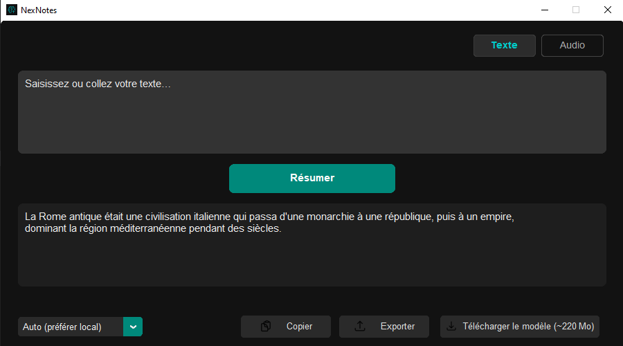

# NexNotes — Transcription et résumé locaux, sans friction

**NexNotes** est une application locale de prise de notes audio/texte, pensée pour être simple, rapide, et entièrement autonome. L’objectif : capturer une idée, la résumer ou la transcrire, sans dépendre d’un service cloud ni perdre de temps.

---

## 📷 Aperçu



---

## Fonctionnalités

- **Résumé de texte** avec T5-small (ou GPT-3.5 si disponible)
- **Transcription audio locale** via Whisper (supporte `.mp3`, `.wav`, `.m4a`)
- **Interface customisée** en `CustomTkinter` (fenêtre sans bordures, drag fluide)
- **Mode offline complet** (aucune dépendance Internet une fois les modèles téléchargés)
- Raccourcis clavier, export/copie intégrés, mode intelligent local/en ligne

---

## ⚙️ Installation

### 1. Cloner le dépôt
```bash
git clone https://github.com/Ybucaille/NexNotes.git
cd NexNotes
```

### 2. Créer un environnement virtuel (recommandé)
```bash
python -m venv venv
source venv/bin/activate     # Linux/macOS
venv\Scripts\activate      # Windows
```

### 3. Installer les dépendances
```bash
pip install -r requirements.txt
```

### 4. (Optionnel) Configurer l’API OpenAI
Crée un fichier `.env` à la racine avec :
```env
OPENAI_API_KEY=sk-...
```

> En l’absence de ce fichier, l'application fonctionne uniquement en **mode local**.

---

## ⬇️ Téléchargement des modèles

Depuis l’application, cliquez sur `Télécharger les modèles`, ou faites-le manuellement :

```bash
# Pour T5-small (résumé)
transformers-cli download t5-small

# Pour Whisper (transcription audio)
transformers-cli download openai/whisper-medium
```

Les modèles seront placés dans :
```
models/summary_model/
models/audio_model/
```

---

## ⌨️ Raccourcis utiles

| Action                | Raccourci |
|-----------------------|-----------|
| Résumer               | Ctrl + R  |
| Copier texte/audio    | Ctrl + C  |
| Exporter .txt         | Ctrl + S  |
| Basculer onglet       | Ctrl + 1 (Texte) / Ctrl + 2 (Audio) |

---

## Pourquoi ce projet ?

J’avais besoin d’un outil léger, local, capable de résumer une idée ou transcrire une note audio **sans passer par une API externe**. NexNotes est né de ce besoin personnel, avec une logique modulaire pour rester simple à maintenir et étendre.

L’interface est volontairement épurée. Le tout tourne localement (sauf si vous activez GPT-3.5), avec des modèles open source et facilement remplaçables.

---

## 🔍 Stack technique

- **Python 3.10+**
- [Transformers (Hugging Face)](https://huggingface.co)
- [Whisper (OpenAI)](https://github.com/openai/whisper)
- [CustomTkinter](https://github.com/TomSchimansky/CustomTkinter)
- Mode en ligne : [OpenAI API](https://platform.openai.com)

---

## ❓ FAQ

**Est-ce que NexNotes fonctionne hors ligne ?**  
> Oui, une fois les modèles téléchargés, tout se passe en local.

**Puis-je changer les modèles ?**  
> Bien sûr. Le code est modulaire : modifiez `core/summarizer.py` ou `core/audio_to_text.py`.

**GPT est-il obligatoire ?**  
> Non. C’est un mode optionnel, utilisé uniquement si vous le configurez.

---

## Crédits

Développé par Yann, pour un usage personnel et local-first.  
Merci à Hugging Face, OpenAI, et la communauté Python pour les outils mis à disposition.

---

## Licence

MIT — libre à toi de t’en inspirer, d’en dériver, ou de contribuer.

[](https://opensource.org/licenses/MIT)
[](https://www.python.org/)